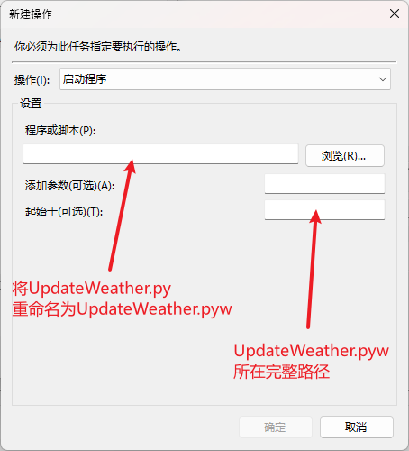
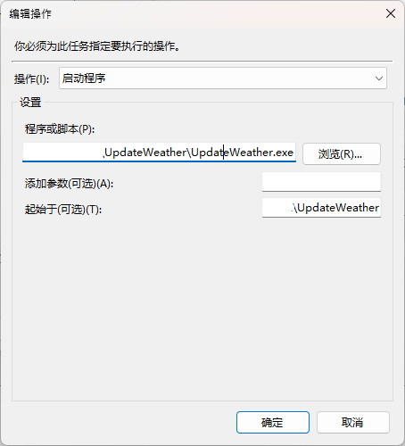

# UpdateWeather      [](https://github.com/HellSakura/UpdateWeather/actions)
调用和风天气api，为瀚文75扩展模块生成天气图片

[](https://www.python.org/)
[](https://github.com/HellSakura/UpdateWeather/releases/latest)
[](https://github.com/HellSakura/UpdateWeather/releases/latest)

## 使用说明
* [申请和风天气api](https://dev.qweather.com/docs/configuration/project-and-key/)，获取`key`和`location`，并填入`config.ini`中

`location` 即 LocationID 可通过[城市搜索服务](https://dev.qweather.com/docs/api/geoapi/city-lookup/)获取或直接在和风天气提供的[China-City-List](https://github.com/qwd/LocationList/blob/master/China-City-List-latest.csv)中查找
```
[DEFAULT]
key = 
location = 
```

* 直接从release里下载打包好的exe文件运行（需要放置`hidapi-win.zip`中的文件）

>需要将`hidapi-win.zip`中对应架构的`hidapi.pdb` `hidapi.lib` `hidapi.dll` 放置在相应的目录中。   
例如64位系统电脑请使用X64文件夹下的文件，放置于`C:\Windows\System32`中


## 效果预览


## 如何刷入墨水屏（任选其一）

* 直接运行打包好的exe程序并配置好`config.ini`即可

* 使用[xingrz](https://github.com/xingrz/zmk-config_helloword_hw-75)开发的  [zmkx.app](https://zmkx.app/)   上位机驱动刷入

* ~~运行`UpdateWeather.py`，会自动刷入墨水屏~~
* ~~运行`picUpdate.py`~~    
     >`picUpdate.py`和`hidapi-win.zip`来自群友`[GNX-Susanoo]`，感谢！

>⚠注意：无论使用哪种方式，扩展模块都需要刷入 xingrz 的[固件](https://github.com/xingrz/zmk-config_helloword_hw-75/tree/master/config/boards/arm/hw75_dynamic)，才能正常工作
## Tips        
* 如果想实现后台自动刷新，最好在自己系统配置python3.8或以上版本的Python环境，并在win计划任务中添加python程序
### 方法一 （无弹窗）
* 在计划任务中添加python程序，将`UpdateWeather.py`重命名为`UpdateWeather.pyw`         
在程序或脚本中填入`UpdateWeather.pyw`所在完整路径          
在起始于中填入`UpdateWeather.pyw`所在文件夹的完整路径


     >例：程序放置于D:\UpdateWeather\文件夹       
     那么      
     程序或脚本中填入D:\UpdateWeather\UpdateWeather.pyw          
     起始于中填入 D:\UpdateWeather
     
        
   
### 方法二 （有弹窗）   

* 直接在计划任务中选择添加打包好的程序，在起始于中填入`UpdateWeather.exe`所在完整路径即可      

     >这会在每次刷新时弹窗
## Todolist    
- [ ] [更多](https://dev.qweather.com/docs/resource/icons/) 的中文天气矢量图 
- [ ] `location`直接填入城市名称即可
- [ ] 无需填写`loccation`，自动获取当前位置
