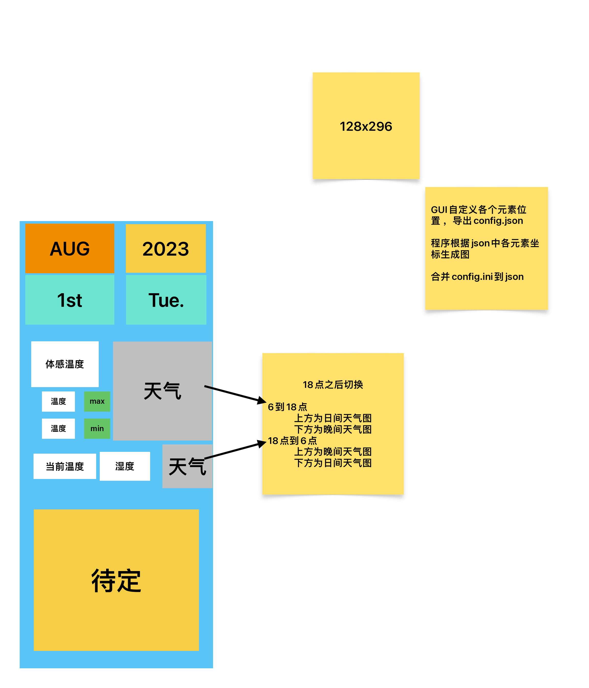

# UpdateWeather      
调用和风天气api，为瀚文75扩展模块生成天气图片

## 效果预览

## 使用说明

>⚠注意：扩展模块需要刷入 xingrz 的[扩展固件](https://github.com/xingrz/zmk-config_helloword_hw-75/tree/master/config/boards/arm/hw75_dynamic)，才能正常工作

* 参见[快速开始](https://github.com/HellSakura/UpdateWeather/wiki/%E5%BF%AB%E9%80%9F%E5%BC%80%E5%A7%8B)

## Todolist    
- [x] 详细的使用说明
- [ ] 支持局部刷新（在想了在想了）
- [ ] [更多](https://dev.qweather.com/docs/resource/icons/) 的中文天气矢量图 
- [ ] `location`直接填入城市名称即可
- [ ] 无需填写`loccation`，自动获取当前位置
- [ ] NEW UI

